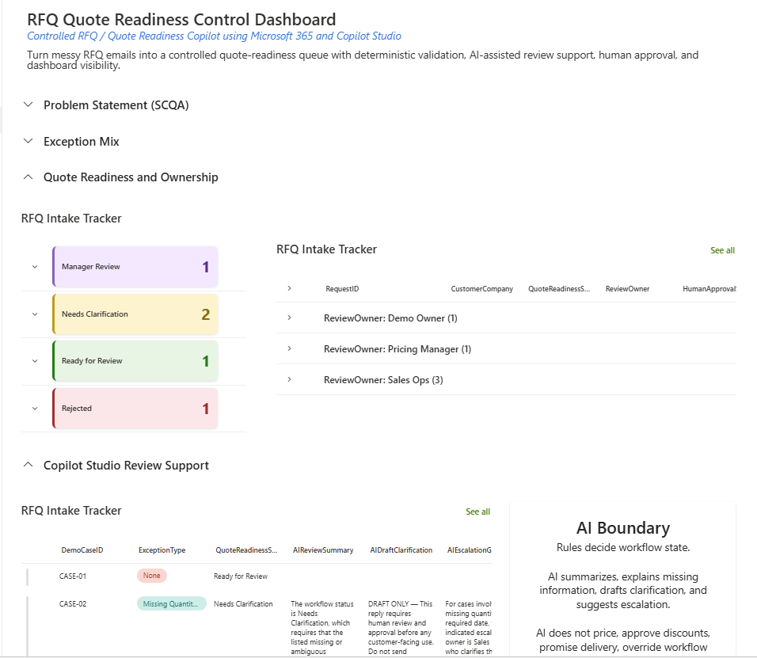

# Controlled RFQ / Quote Readiness Copilot

A Microsoft 365 workflow demo that turns structured RFQ intake into a controlled quote-readiness process with deterministic validation, exception routing, bounded AI assistance, human review, and management visibility.

## Watch the Demo

[Watch the 6-minute walkthrough on YouTube](https://www.youtube.com/watch?v=4Ty1OLVGFws)



## Business Problem

Many B2B sales and operations teams manage quotation requests through email, spreadsheets, shared folders, and manual follow-up.

Typical problems include:

* incomplete RFQ information
* unclear review ownership
* discount requests requiring escalation
* unsupported attachments
* delayed customer clarification
* no consolidated exception view
* AI-generated drafts without sufficient controls

## Solution Outcome

The demo converts each synthetic RFQ into a controlled workflow record.

```text
RFQ CSV uploaded to SharePoint
-> Power Automate parses the intake
-> deterministic rules validate quote readiness
-> status, exception and review owner are assigned
-> file is routed to the appropriate folder
-> Copilot retrieves the authoritative SharePoint record
-> AI generates bounded internal review support
-> human review remains mandatory
```

The workflow continues to operate even when the AI layer is unavailable.

## Architecture

```text
SharePoint Document Library
        |
        v
Power Automate Intake Flow
- CSV parsing
- deterministic validation
- exception classification
- owner assignment
- file routing
        |
        v
SharePoint RFQ Intake Tracker
- workflow source of truth
- status and completeness
- exception and risk fields
- human approval evidence
        |
        v
Read-Only Copilot Agent Flow
- normalizes DemoCaseID
- validates input format
- reads one SharePoint record
- returns Found, NotFound or InvalidInput
        |
        v
RFQ Review Copilot
- summarizes the RFQ
- explains missing information
- drafts clarification wording
- provides escalation guidance
```

## Main Demonstration Case

`CASE-03` demonstrates an RFQ that is complete enough for internal review but contains a discount request requiring commercial escalation.

```text
Customer: Demo Regional Distributor Pte Ltd
Product: Industrial Sensor Kit A
Quantity: 1200 Units
Required Date: 14 July 2026
Delivery Location: Tuas Singapore
Quote Readiness Status: Manager Review
Exception Type: Discount Requested
Review Owner: Pricing Manager
Completeness Score: 85
```

The Copilot retrieves these values from SharePoint through a read-only Agent Flow. It does not rely on the user manually pasting the case details.


## Control Boundaries

The deterministic workflow decides:

* quote-readiness status
* validation result
* exception type
* risk flag
* review owner
* completeness score
* file-routing destination

The AI may:

* summarize the request
* explain missing or ambiguous information
* draft clarification text
* provide internal escalation guidance

The AI may not:

* calculate or issue final prices
* approve discounts
* approve quotations
* promise delivery
* alter deterministic workflow fields
* update SharePoint
* send an external reply
* approve its own output

Human approval and external sending remain separate controls.

```text
HumanApprovalStatus = Approved
FinalReplySent = No
```

`Approved` means the internal AI output was accepted by a human reviewer. It does not mean that a customer reply was sent.

## Test Coverage

| Case    | Scenario                                   | Expected outcome    |
| ------- | ------------------------------------------ | ------------------- |
| CASE-01 | Complete standard request                  | Ready for Review    |
| CASE-02 | Quantity and required date missing         | Needs Clarification |
| CASE-03 | Discount request                           | Manager Review      |
| CASE-04 | Unsupported attachment                     | Rejected            |
| CASE-05 | Ambiguous product or service specification | Needs Clarification |

The read-only Copilot retrieval layer also passed:

* `Found`
* `NotFound`
* `InvalidInput`
* lowercase and whitespace input normalization

## Repository Contents

```text
docs/
  architecture-and-controls.md
  test-cases.md

copilot-studio/
  agent-instructions.md
  compiled-rfq-knowledge.md

sample-data/
  five synthetic RFQ CSV files

screenshots/
  eight workflow and control screenshots
```

## Technology

* Microsoft SharePoint
* Microsoft Power Automate
* Microsoft Copilot Studio
* SharePoint Lists and document libraries
* Synthetic CSV test data

## Limitations

This is a portfolio prototype using synthetic data.

It does not include production authentication design, customer-facing sending, SharePoint writeback from Copilot, pricing calculation, ERP or CRM integration, production monitoring, formal security testing, or regulated-data processing.

See [limitations.md](limitations.md) for the full boundary statement.
