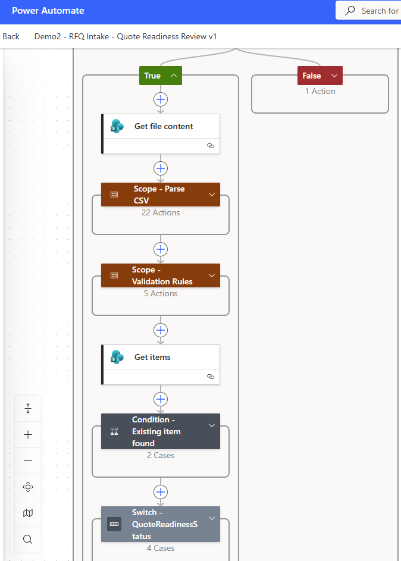
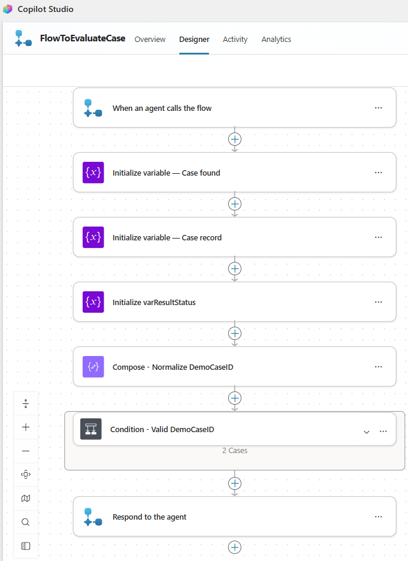

# Architecture and Controls

## Architecture Principle

This demo uses a deterministic workflow spine with AI as a bounded review assistant.

```text
SharePoint + Power Automate
= workflow state, validation, routing and source of truth

Copilot Studio
= internal summarization, explanation, drafting and escalation guidance

Human reviewer
= approval and external-action boundary
```

The intake workflow remains functional without Copilot Studio.

## End-to-End Architecture

```text
Synthetic RFQ CSV
        |
        v
SharePoint Document Library
/Incoming
        |
        v
Power Automate Intake Flow
- parse controlled CSV
- validate required information
- identify exceptions
- assign status and review owner
- calculate completeness score
- update SharePoint tracker
- route file by outcome
        |
        v
SharePoint RFQ Intake Tracker
- authoritative workflow record
- status and validation result
- exception and risk fields
- ownership and completeness
- AI evidence and human-control fields
        |
        v
Copilot Studio Tool
Get RFQ case from SharePoint
        |
        v
Read-Only Agent Flow
- normalize DemoCaseID
- validate identifier format
- query SharePoint
- return deterministic fields
- return Found, NotFound or InvalidInput
        |
        v
RFQ Review Copilot
- summarize request
- explain missing information
- draft clarification wording
- provide escalation guidance
        |
        v
Human Review
Approved internal draft
does not equal external send
```

## 1. SharePoint Storage and Workflow State

### Document Library

The SharePoint document library stores the controlled CSV intake files.

Routing folders:

```text
Incoming
Processed
NeedsReview
Rejected
Archive
```

Routing outcomes:

| Quote-readiness outcome | Destination   |
| ----------------------- | ------------- |
| Ready for Review        | `Processed`   |
| Needs Clarification     | `NeedsReview` |
| Manager Review          | `NeedsReview` |
| Rejected                | `Rejected`    |

### RFQ Intake Tracker

The SharePoint list is the authoritative source of workflow state.

Key deterministic fields include:

```text
DemoCaseID
CustomerCompany
RequestType
ProductOrServiceRequested
Quantity
QuantityUOM
RequiredDate
DeliveryLocation
AttachmentStatus
ValidationResult
MissingFields
RiskFlag
ExceptionType
QuoteReadinessStatus
ReviewOwner
CompletenessScore
```

Existing AI output must not replace or override these deterministic fields.

## 2. Deterministic Intake Flow

Power Automate performs the repeatable workflow logic.

```text
File created in /Incoming
-> verify CSV input
-> read controlled one-row CSV
-> map fields
-> apply validation rules
-> assign workflow status
-> assign exception type
-> assign review owner
-> calculate completeness score
-> update or create SharePoint record
-> route file by final status
```

The principal workflow outcomes are:

| Status              | Meaning                                                         |
| ------------------- | --------------------------------------------------------------- |
| Ready for Review    | Required information is available for internal quotation review |
| Needs Clarification | Customer information is missing or ambiguous                    |
| Manager Review      | Commercial or operational escalation is required                |
| Rejected            | Input is unsupported or outside the accepted intake rules       |

The rules, not the AI, assign these outcomes.



## 3. Read-Only Copilot Retrieval

The Copilot does not depend on users manually pasting the full RFQ record.

The user supplies only a `DemoCaseID`.

```text
User enters DemoCaseID
-> Agent Flow normalizes the value
-> lightweight format validation runs
-> SharePoint is queried
-> matching deterministic record is returned
-> Copilot reviews the returned CaseRecord
```

Normalization:

```text
case-03
 CASE-03
CASE-03

-> CASE-03
```

Validation checks only that the identifier:

```text
is not blank
and
starts with CASE-
```

The flow does not contain a hardcoded list of `CASE-01` to `CASE-05`.

Future identifiers such as `CASE-06` or `CASE-100` can reach the SharePoint lookup without changing the flow. SharePoint determines whether the record exists.

### Returned ResultStatus

| ResultStatus | Behaviour                                           |
| ------------ | --------------------------------------------------- |
| Found        | Return the matching deterministic SharePoint record |
| NotFound     | Return a controlled no-record message               |
| InvalidInput | Return a controlled identifier-format message       |

The tool is read-only:

* no SharePoint update
* no status change
* no AI-field writeback
* no external reply
* no approval action



## 4. AI Control Boundary

### AI May

* summarize the RFQ
* explain missing or ambiguous information
* draft customer clarification wording
* provide internal escalation guidance
* produce an internal control note

### AI May Not

* calculate a final price
* recommend or approve a discount
* approve a quotation
* promise delivery or service dates
* change `QuoteReadinessStatus`
* change `ExceptionType`
* change `ReviewOwner`
* change `RiskFlag`
* change `CompletenessScore`
* update SharePoint
* send an external response
* mark `FinalReplySent`
* approve its own output

The deterministic SharePoint record remains authoritative.

## 5. Human Approval Boundary

The demo separates acceptance of an internal AI draft from customer communication.

```text
HumanApprovalStatus = Approved
FinalReplySent = No
```

Interpretation:

```text
Approved
= a human accepted the AI-generated content as internal review evidence

FinalReplySent = No
= no customer-facing response was sent
```

An approved AI draft is not treated as an approved quotation, discount, delivery commitment, or external communication.

## 6. Compiled Knowledge Boundary

The Copilot uses synthetic compiled operating knowledge covering:

* RFQ readiness requirements
* missing-information rules
* pricing-review escalation
* delivery-date restrictions
* clarification wording
* review-owner guidance
* prohibited actions

The knowledge source contains no real customer data, real pricing, confidential commercial policy, or production commitment.

The agent is instructed to use the deterministic SharePoint fields as authoritative and not invent additional requirements.

## 7. Control Ownership

| Control                              | Owner                      |
| ------------------------------------ | -------------------------- |
| Input-file structure                 | Controlled intake design   |
| Required-field validation            | Power Automate             |
| Quote-readiness status               | Power Automate             |
| Exception classification             | Power Automate             |
| Review-owner assignment              | Power Automate             |
| Workflow source of truth             | SharePoint                 |
| RFQ retrieval                        | Read-only Agent Flow       |
| Summary and draft wording            | Copilot Studio             |
| Acceptance or rejection of AI output | Human reviewer             |
| External customer communication      | Outside current demo scope |

## 8. Scope Boundary

This architecture demonstrates a portfolio pattern, not a production CPQ or CRM system.

Explicitly excluded:

* live pricing
* quotation generation
* CRM or ERP integration
* inventory or capacity confirmation
* autonomous customer replies
* Copilot writeback
* real customer data
* production identity and access design
* production monitoring and support
* high-volume or hostile-file processing

