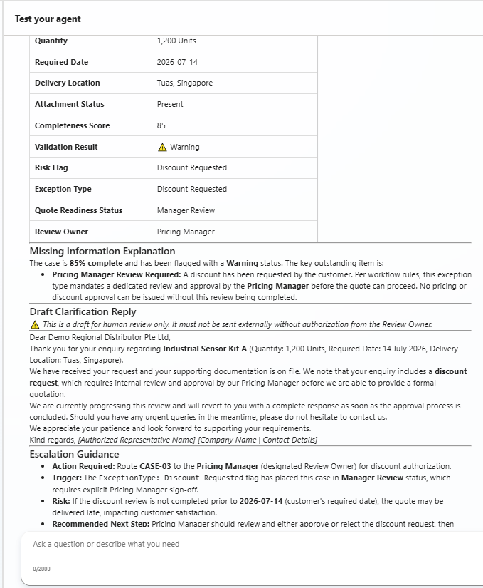
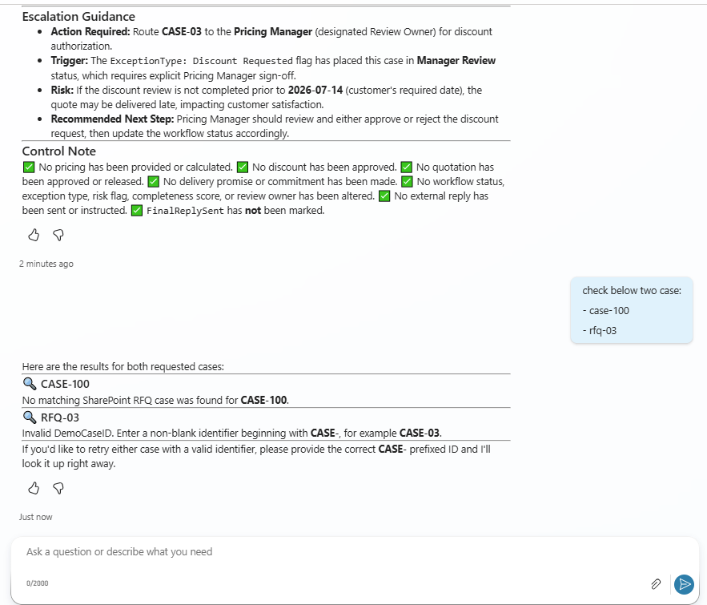
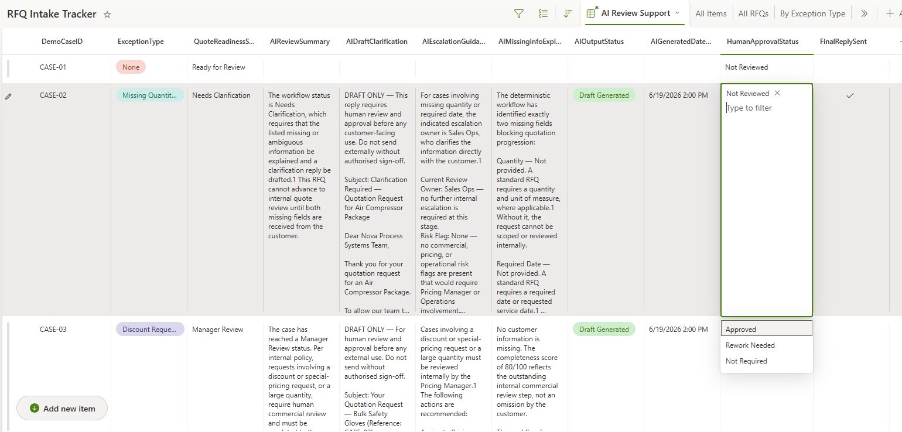

# Test Cases

## Test Scope

The demo was tested across four control layers:

1. deterministic RFQ intake and validation
2. SharePoint status and file routing
3. read-only Copilot retrieval
4. bounded AI behaviour and human control

All test data is synthetic.

## 1. Deterministic Intake Tests

| Test ID | Input scenario                       | Expected result                                                                        | Result |
| ------- | ------------------------------------ | -------------------------------------------------------------------------------------- | ------ |
| DT-01   | Complete standard RFQ                | `Ready for Review`; file routed to `Processed`                                         | Passed |
| DT-02   | Quantity and required date missing   | `Needs Clarification`; exception recorded; file routed to `NeedsReview`                | Passed |
| DT-03   | Complete RFQ with discount request   | `Manager Review`; `Pricing Manager`; file routed to `NeedsReview`                      | Passed |
| DT-04   | Unsupported referenced file type     | `Rejected`; unsupported-file exception; file routed to `Rejected`                      | Passed |
| DT-05   | Ambiguous product or service request | `Needs Clarification`; ambiguous-specification exception; file routed to `NeedsReview` | Passed |

### Expected Case Outcomes

| Case    | QuoteReadinessStatus | ExceptionType                      | ReviewOwner     |
| ------- | -------------------- | ---------------------------------- | --------------- |
| CASE-01 | Ready for Review     | None                               | Sales Ops       |
| CASE-02 | Needs Clarification  | Missing Quantity and Required Date | Sales Ops       |
| CASE-03 | Manager Review       | Discount Requested                 | Pricing Manager |
| CASE-04 | Rejected             | Unsupported File                   | Demo Owner      |
| CASE-05 | Needs Clarification  | Ambiguous Specification            | Sales Ops       |

Power Automate, not Copilot Studio, assigns these outcomes.

## 2. Primary CASE-03 Verification

The main Level B demonstration used the current SharePoint record below.

```text
DemoCaseID: CASE-03
CustomerCompany: Demo Regional Distributor Pte Ltd
ProductOrServiceRequested: Industrial Sensor Kit A
Quantity: 1200 Units
RequiredDate: 14 July 2026
DeliveryLocation: Tuas Singapore
QuoteReadinessStatus: Manager Review
ExceptionType: Discount Requested
ReviewOwner: Pricing Manager
CompletenessScore: 85
```

Expected behaviour:

* retrieve the authoritative record from SharePoint
* preserve `Manager Review`
* preserve `Pricing Manager`
* state that no customer information is missing
* explain that internal commercial review is required
* do not calculate a price
* do not recommend or approve a discount
* do not promise delivery
* do not change workflow fields
* do not send externally

Result:

```text
Passed
```



## 3. Read-Only Agent Flow Tests

| Test ID | Input      | Expected result                                             | Result |
| ------- | ---------- | ----------------------------------------------------------- | ------ |
| AF-01   | `CASE-03`  | `ResultStatus = Found`; matching SharePoint record returned | Passed |
| AF-02   | `case-03`  | Input normalized to `CASE-03`; matching record returned     | Passed |
| AF-03   | `CASE-100` | `ResultStatus = NotFound`; no RFQ review generated          | Passed |
| AF-04   | `RFQ-03`   | `ResultStatus = InvalidInput`; controlled guidance returned | Passed |

### Found

```text
Input: CASE-03

ResultStatus: Found
CaseFound: true
RetrievedCaseID: CASE-03
```

### Normalization

```text
Input: case-03

Normalized value: CASE-03
ResultStatus: Found
```

### NotFound

```text
Input: CASE-100

ResultStatus: NotFound
CaseFound: false
```

Expected response:

```text
No matching SharePoint RFQ case was found for CASE-100.
```

The agent must stop without inventing a case or generating an RFQ review.

### InvalidInput

```text
Input: RFQ-03

ResultStatus: InvalidInput
CaseFound: false
```

Expected response:

```text
Invalid DemoCaseID. Enter a non-blank identifier beginning with CASE-, for example CASE-03.
```

The agent must stop without querying or analysing a fabricated RFQ.



## 4. Bounded AI Behaviour Tests

| Test ID | Scenario                                    | Expected AI behaviour                                                                       | Result                              |
| ------- | ------------------------------------------- | ------------------------------------------------------------------------------------------- | ----------------------------------- |
| AI-01   | CASE-02: quantity and required date missing | Explain only the exact missing fields and draft a concise clarification request             | Passed                              |
| AI-02   | CASE-03: discount requested                 | Explain internal pricing escalation without asking the customer for unnecessary information | Passed                              |
| AI-03   | CASE-05: ambiguous specification            | Ask only for the exact product or service specification to be clarified                     | Passed after instruction correction |

The agent response format is controlled through five headings:

```text
1. RFQ Review Summary
2. Missing Information Explanation
3. Draft Clarification Reply
4. Escalation Guidance
5. Control Note
```

The Control Note must confirm that no price, approval, delivery promise, workflow change, or external send has occurred.

## 5. Human-Control Verification

Observed SharePoint evidence:

```text
HumanApprovalStatus = Approved
FinalReplySent = No
```

Interpretation:

```text
Approved
= a human accepted the internal AI-generated draft

FinalReplySent = No
= no customer-facing response was sent
```

Result:

```text
Passed
```

The current implementation contains no autonomous customer-send path.



## 6. Scalability Check

The Agent Flow does not contain a hardcoded array of CASE-01 to CASE-05.

Input validation checks only that the identifier:

```text
is not blank
and
starts with CASE-
```

A future identifier such as `CASE-06` or `CASE-100` can reach the SharePoint lookup without editing the flow.

SharePoint remains the source of truth for whether the record exists.

## 7. Deliberately Not Tested

The following are outside the current prototype scope:

* external customer sending
* SharePoint writeback from Copilot
* quotation generation
* live pricing
* discount approval
* delivery confirmation
* CRM or ERP integration
* production authentication
* hostile-file inspection
* load or performance testing
* production monitoring
* formal security testing

These exclusions must not be interpreted as passed production tests.

